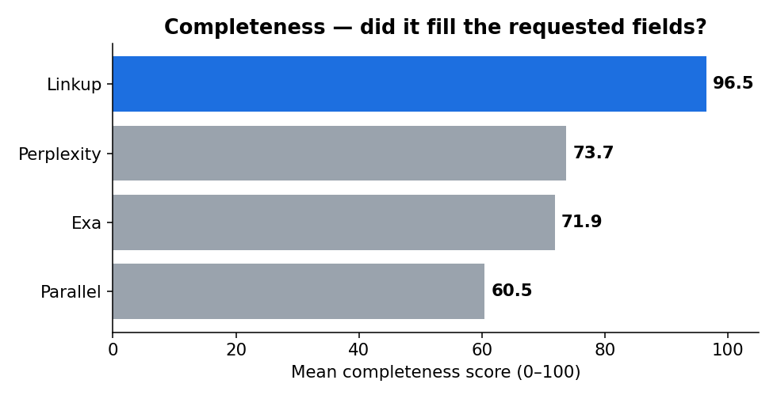
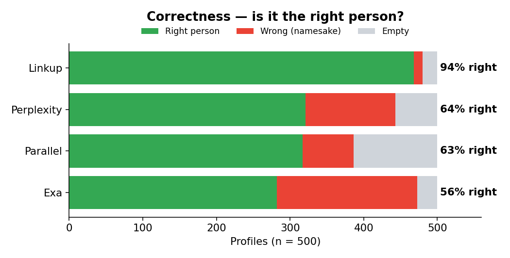
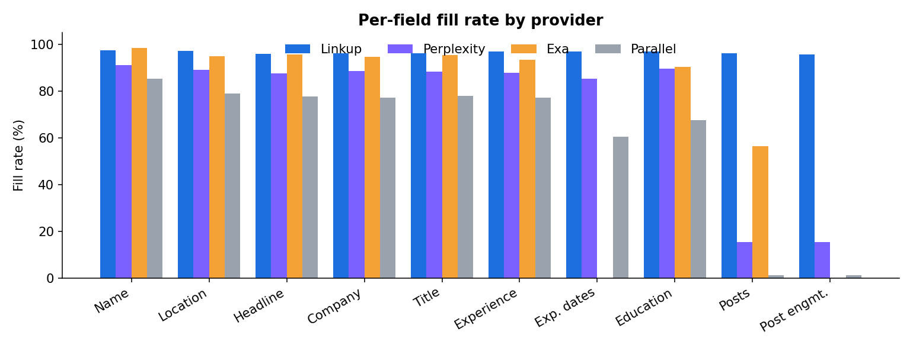

# LinkedIn Profile Extraction Benchmark

How well do web-search / answer APIs extract a **specific person's** LinkedIn profile when you hand them the exact profile URL?

We gave four APIs — **Linkup, Exa, Perplexity, Parallel** — the same tasks across real LinkedIn profiles and ran four evals:

1. **Completeness** — did it fill the fields we asked for?
2. **Correctness** — is it the *right person*, with data matching ground truth?
3. **Pre-meeting brief quality** — turn each engine's *raw web results* into a sales brief; which one actually preps you for the meeting? *(separate task, n=100 — see [Eval 3](#eval-3--pre-meeting-brief-quality-a-different-task))*
4. **Freshness** — for people who *just changed jobs*, does it surface the NEW company or the stale old one? *(n=57 — see [Eval 4](#eval-4--freshness--recent-job-change-detection))*

## TL;DR

**Linkup wins all four evals.** Because it *fetches the URL you hand it* instead of searching for the name, it gets the right person 94% of the time; the search-based APIs return *a person with the right name at the wrong company* on 36–44% of profiles — and when someone just changed jobs, they report the **stale** old employer.

| | Completeness (n=500) | Right person (n=500) | Wrong (namesake) | Brief quality (n=100) | Catches job change (n=57) |
|---|---|---|---|---|---|
| **Linkup** | **96.5** | **94%** | **12** | **64.8** | **74%** |
| Perplexity | 73.7 | 64% | 122 | 53.1 | 9% |
| Exa | 71.9 | 56% | 191 | 55.8 | 14% |
| Parallel | 60.5 | 63% | 69 | 59.8 | 11% |

- **Completeness** — Linkup fills 96.5/100 of requested fields; next best is 73.7.
- **Correctness** — Linkup returns the wrong person only 12/500 times; Exa does 191/500 (38%).
- **Brief quality** — judged by Opus 4.8 on freshness + specificity + actionability, Linkup produces the best pre-meeting brief for 51 of 100 people.
- **Freshness** — for 57 people who just changed jobs, Linkup reports the new employer 74% of the time; the others land on the *previous* company and report it as current (Exa/Parallel are STALE on ~30/57).

---

## The task

For each of 500 people, every API gets the identical prompt + JSON schema:

> Return the full LinkedIn profile of `{url}` (`{name}`). Extract: full name, location, headline,
> current company and title, complete work experience (company/title/start/end), education,
> and most recent posts (text, date, like/comment counts).

Each API is called through its **own native structured-output surface** (no Claude/LLM layer in the extraction step), so we're measuring the API itself:

| API | Endpoint | Structured output |
|---|---|---|
| **Linkup** | `POST /v1/search` | `outputType:"structured"` + `structuredOutputSchema` |
| **Exa** | `POST /search` | `outputSchema` |
| **Perplexity** | `POST /chat/completions` (`sonar-pro`) | `response_format.json_schema` |
| **Parallel** | Task API `POST /v1/tasks/runs` (`lite`) | `task_spec.output_schema` |

---

## The two evals

### 1. Completeness (deterministic, 10-field rubric)
Each requested field that comes back non-empty scores 1 point → `score = filled / 10 × 100`.
Fields: `full_name, location, headline, current_company, current_title, experience, experience-with-dates, education, recent_posts, post-engagement`.

This measures *how much* came back — but **not whether it's the right person**. An API can score high here by confidently filling boxes for the wrong human.

### 2. Correctness (vs. a real ground-truth DB)
We join each response to `data/ground_truth_500.csv` (the authoritative profile for that URL) and check:

- **right-person** — does the returned `current_company` match the real person's company? *(the namesake detector)*
- **title ✓** / **name ✓** — fuzzy match vs ground truth
- **wrong (namesake)** — confidently returned a company that **isn't** the real person's
- **empty** — abstained / no company returned

Matching is token-set with company-suffix stripping (e.g. `Capital Bancorp Plc` ≈ `Capital Bancorp`). Ground truth is an **independent** DB — not derived from any of the four APIs — so there's no self-reference bias.

---

## Results (n = 500)

> ### 💼 GTM use case: CRM enrichment
> You have a list of LinkedIn URLs — inbound leads, a conference attendee list, a book of accounts — and you want to **enrich each contact** with title, company, location, and work history written back into Salesforce/HubSpot. This is exactly the extraction task, and it's where **completeness** and **correctness** both matter:
> - **Completeness = field coverage.** An enrichment that returns `title` and `location` but leaves `company` and `experience` empty is a half-filled record a rep still has to finish by hand. Linkup fills **96.5%** of requested fields vs **60–74%** for the others.
> - **Correctness = not poisoning the CRM.** Writing a *namesake's* company into a contact record is worse than leaving it blank — now the rep trusts bad data and emails the wrong account. Linkup writes the wrong company only **12/500** times; Exa does it **191/500** (38%). At scale, that's the difference between a clean database and one a third of your team has learned to distrust.

### Completeness
| Provider | Mean | Median | Fully empty |
|---|---|---|---|
| **Linkup** | **96.5** | 100 | 13 |
| Perplexity | 73.7 | 80 | 38 |
| Exa | 71.9 | 80 | 8 |
| Parallel | 60.5 | 80 | 74 |



### Correctness
| Provider | Right person | Wrong (namesake) | Empty | Title ✓ | Name ✓ |
|---|---|---|---|---|---|
| **Linkup** | **94%** | **12** | 20 | 93% | 97% |
| Perplexity | 64% | 122 | 57 | 61% | 86% |
| Parallel | 63% | 69 | 114 | 58% | 85% |
| Exa | 56% | **191** | 27 | 54% | 92% |



The three search-based APIs spend a large share of their bar on the **wrong person** (red) or on **abstaining** (grey); Linkup's bar is almost entirely right-person.

### What it means
- **Name match is high for everyone (85–97%) — but company match collapses to ~56–64%** for the three that search instead of fetch. They return *a person with the right name* at the **wrong company**.
- **Exa returns the wrong human 191/500 times (38%).** Perplexity 122, Parallel 69 (+114 abstentions).
- **Linkup gets the wrong company only 12/500 times (94% correct)** because it dereferences the URL instead of searching for the name.
- On completeness, the gap is in the **deep, verifiable fields** — dated work history (Exa 0%), education, and posts + engagement (only Linkup returns posts at scale).



**Takeaway:** completeness alone flatters search-based APIs because they fill the name box; correctness exposes that ~36–44% of their filled profiles are the *wrong person* or empty. For URL-anchored profile extraction, fetching the URL (Linkup) beats searching for the name.

---

## Eval 3 — Pre-meeting brief quality (a different task)

> ### 💼 GTM use case: account research before a sales call
> A rep has a meeting with a prospect in 30 minutes and opens their LinkedIn. They don't need a structured dump of fields — they need a **brief**: what has this person been posting about, what changed at their company recently, and *what should I actually ask them*. The engine that surfaces a post from last week and a just-announced funding round preps the rep to walk in warm; the one that returns a 2019 job title preps them for a meeting that already happened. That's what this eval measures — and why **freshness** is weighted heaviest.

Extraction is one job; **prepping for a meeting** is another. Here each engine is hit at its **raw web-results endpoint** (Linkup `/v1/search` searchResults · Exa `/search`+highlights · Perplexity `/search` · Parallel `/v1/search`, 20 results each), and a **Sonnet synthesizer** turns those results into a pre-meeting brief — *notes* + *conversation questions* — using only what the API returned.

An **Opus 4.8 judge** then scores each brief the way a salesperson would: *holding all four briefs, which one preps me better to walk into the meeting right now?* The rubric is weighted and ground-truth-anchored:

```
overall = freshness*0.35 + specificity*0.30 + actionability*0.35     (capped at 15 if wrong person / empty)
```

- **freshness** — recent, time-relevant intel (recent posts, a just-announced move, current events) > a 2019 job date
- **specificity** — concrete *grounded* detail (names/numbers/dates); fabricated or ground-truth-contradicting claims **subtract**
- **actionability** — sharp, tailored questions vs generic boilerplate ("What are your goals this year?")

> `overall` is computed deterministically from the judged sub-scores — the model's own holistic number is not trusted.

### Results (n = 100)

| Engine | **Overall** | Freshness | Specificity | Actionability | Right-person | Wins (best/person) |
|---|---|---|---|---|---|---|
| **Linkup** | **64.8** | **58.6** | 69.4 | **68.2** | 92% | **51** |
| Parallel | 59.8 | 45.9 | **70.1** | 64.9 | 91% | 26 |
| Exa | 55.8 | 43.9 | 66.0 | 59.9 | 83% | 16 |
| Perplexity | 53.1 | 42.6 | 59.7 | 58.1 | 95% | 6 |

### What it means
- **Freshness is the differentiator** — Linkup 58.6 vs ~43–46. It surfaces recent-activity hooks (posts referenced in 91/100 briefs) the others miss, and that's what makes a brief usable *today*.
- **Linkup is the best brief for 51/100 people** (Parallel 26). It's honest, not lopsided: Parallel still narrowly edges raw **specificity** (verbose static detail), and Perplexity is most reliable on **right-person** (95%).
- An earlier, recency-blind rubric called this a Parallel tie — because it rewarded *volume* and treated a 2019 job date as worth the same as a post from last week. Weighting what a salesperson actually needs (recent + specific + tailored) puts Linkup on top.

**Note:** briefs are **model-generated** and intentionally include the engines' mistakes (namesakes, stale or speculative claims) — surfacing those is exactly what the judge measures.

---

## Eval 4 — Freshness / recent job-change detection

> ### 💼 GTM use case: job-change signals
> A person leaving a customer account for a new company is one of the highest-value sales triggers there is — your champion just landed somewhere new and might buy again. But the signal is only useful if it's **fresh**: an enrichment that still shows their *old* employer doesn't just fail to help, it tells you to call the wrong company.

This is a targeted subset of **57 people who all just changed jobs** (most with a current-role start in the current month). Each engine gets the person's *old* role and is asked — via its native structured output — for their **current** employer/title and whether they changed companies. The test: does it surface the **new** job, or the **stale** old one?

Because company names appear in different languages, transliterations, and abbreviations across sources (an Arabic company name vs its English equivalent, `JP Morgan` vs `J.P. Morgan`), string matching misclassifies real matches — so an **Opus 4.8 judge** classifies each engine against the verified new + previous role:

- **FRESH** — reported the NEW current company (caught the change) ← the goal
- **STALE** — found the right person but reported the PREVIOUS company (missed the change)
- **WRONG_PERSON** — namesake / a company matching neither
- **NOT_FOUND** — abstained / empty

### Results (n = 57)

| Engine | FRESH | STALE | WRONG | Not found | **Fresh %** | Change flagged ✓ |
|---|---|---|---|---|---|---|
| **Linkup** | **42** | 7 | 4 | 4 | **74%** | 37 |
| Exa | 8 | 32 | 11 | 6 | 14% | 10 |
| Parallel | 6 | 30 | 11 | 10 | 11% | 17 |
| Perplexity | 5 | 17 | 7 | 28 | 9% | 6 |

### What it means
- **Linkup catches the job change 74% of the time**; the next best is 14%.
- The others' dominant failure mode is **STALE** (Exa 32, Parallel 30 of 57): they *find the right person* but report the **previous** employer as current — the worst outcome for a job-change signal, because it looks confident and is wrong. Perplexity mostly abstains (28 not-found).
- Same root cause as Evals 1–2: fetching the live profile surfaces the move; searching the name lands on cached/old pages.

> The deterministic English-only version of this check scored Linkup 35 and slightly **over**-credited the others — cross-language judging corrected it to 42 (Linkup) and *down* for the rest. The LLM judge is the fair call here.

---

## Run it yourself

```bash
pip install -r requirements.txt
python3 eval.py          # -> results/benchmark_500.xlsx
python3 make_charts.py   # -> charts/*.png (the graphs above)
```

`eval.py` outputs `results/benchmark_500.xlsx`:
- **Summary** — both evals + per-field fill rates
- **Completeness** — per-person score for each API (color-scaled)
- **Correctness detail** — per-person: real company/title vs. what each API returned, with ✓ / ✗ / — flags

`make_charts.py` reuses the same eval functions, so the charts always match the spreadsheet.

For the meeting-brief eval (Eval 3):

```bash
python3 eval_meeting_briefs.py            # rebuilds results/meeting_brief_judge.xlsx from cached judge verdicts (no API key needed)
python3 eval_meeting_briefs.py --rejudge  # re-runs the Opus 4.8 judge (needs `anthropic` + ANTHROPIC_API_KEY)
```

The judge verdicts are cached in `results/brief_judge_raw.json`, so the scores reproduce exactly without re-calling the API. Scoring/aggregation is deterministic from those verdicts.

For the freshness / job-change eval (Eval 4):

```bash
python3 eval_freshness.py            # rebuilds results/freshness_judge.xlsx from cached judge verdicts (no API key needed)
python3 eval_freshness.py --rejudge  # re-runs the Opus 4.8 judge (needs `anthropic` + ANTHROPIC_API_KEY)
```

Verdicts cached in `results/jc_judge_raw.json`.

---

## Files

```
data/
  api_outputs_500.csv             # extraction: each API's structured response per profile
  ground_truth_500.csv            # authoritative profile fields per linkedin_url (the source of truth)
  brief_outputs_100.csv           # meeting-brief: each engine's synthesized brief (notes + questions) per person
  jc_outputs_57.csv               # freshness: each engine's structured response for 57 recent job-changers
  job_change_ground_truth_57.csv  # verified new + previous role per job-changer
eval.py                  # Evals 1 & 2 (completeness + correctness), writes benchmark_500.xlsx
eval_meeting_briefs.py   # Eval 3 (brief quality), writes meeting_brief_judge.xlsx
eval_freshness.py        # Eval 4 (job-change freshness), writes freshness_judge.xlsx
make_charts.py           # regenerates charts/*.png from the same data
results/
  benchmark_500.xlsx       # extraction report
  meeting_brief_judge.xlsx # brief-quality report (Summary + Per-person)
  freshness_judge.xlsx     # job-change freshness report (Summary + Per-person)
  brief_judge_raw.json     # cached Opus judge verdicts (so Eval 3 reproduces without an API key)
  jc_judge_raw.json        # cached Opus judge verdicts for Eval 4
charts/
  completeness.png       # mean completeness per provider
  correctness.png        # right / wrong / empty, stacked, per provider
  field_fill.png         # per-field fill rate by provider
```

## Method notes & caveats
- **Completeness ≠ correctness.** A filled field isn't necessarily the right person — that's exactly why both evals exist.
- All APIs were called at their **base/standard tier** (Linkup `standard`, Exa `auto`, Perplexity `sonar-pro`, Parallel `lite`) with no result/content caps that would handicap any one of them.
- Matching is fuzzy by design (companies are written many ways); thresholds live at the top of `eval.py` if you want to tighten them.
